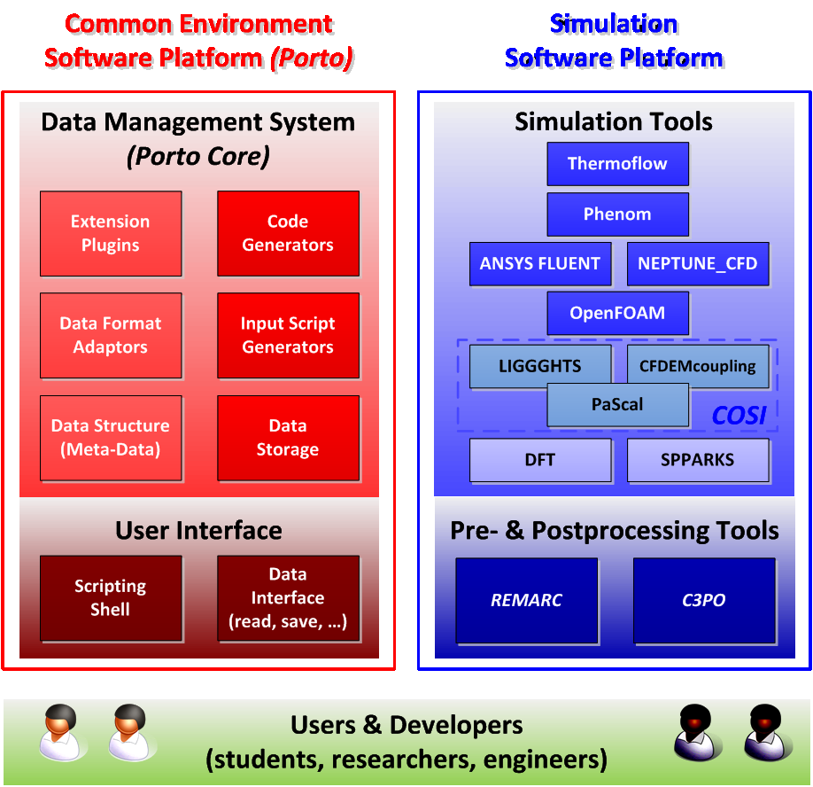
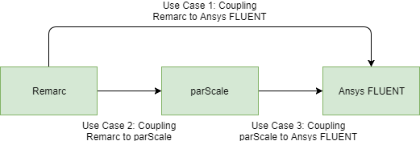
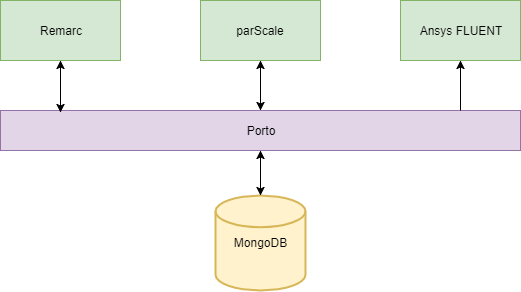

# NanoSim/Porto Overview
Porto is build on top of SOFT5 and is the "glue" between the different
simulators that needs to publish and/or exchange data. Porto uses all
the major elements from SOFT5 such as the MongoDB storage module, the
scripting tools, code generation framework and APIs to extend with
custom data readers/writers.

## Modularity and reusability

The Porto framework encourages a data driven approach to application
development. Instead of encapsulation and data hiding (as is the key
concept in object oriented programming), the data is public and
explicit. An effect of this is that individual models or offline
simulation codes that are developed can be very specialized (modular)
and need only to relate to the data and not (necessarily) to other
computational codes.

A key feature of Porto is to enable offline-coupling of physical
processes occurring on different scales.

## Key Features of the Porto platform.
The structure of the NanoSim platform is shown in Figure 1, where also the components of the two software platforms are visible. The Porto Core is a system that includes generic tools such as a code generator that allow for rapid development of interfaces, wrappers, and automatic programming of filtered models etc. 

The meta-data module is important, as all data that will be shared
between different processes and applications needs to be well
defined. The data storage module is the central database storage
system and the existing tool; MongoDB ( http://www.mongodb.org/), will
employed for this purpose. MongoDB is a data management and data
aggregation system and offers important features such as a free text
query system that is fast and scalable. MongoDB supports automatic
data partitioning for scalability and full index support.

A programming interface (API) for developing data format adaptors is
included in the user interface system of Porto to support 3rd party
data formats. When using the data interface module of Porto, the data
stored in separate formats are searchable and available through the
same interfaces as the data stored in the central data storage
system. . To further simplify the usage of these tools, the user
interface of Porto includes a scripting shell that can access all the
functionalities of the Porto framework. The scripting shell will also
be the central interface of the NanoSim platform. In addition, users
and developers will be able to interface with specific tools on the
NanoSim platform in ways they are familiar with (e.g., existing
graphical user interfaces for computational fluid dynamics software,
etc.). Future extensions of Porto might include a graphical user
interface in addition to the scripting shell.

# Demonstrated Use Cases using Porto

In order to demonstrate how Porto is used, three use cases are in this document demonstrated. Connections between different scales are in practice making simulation software able to pass information to each other.

The three use cases are:

1. Coupling from atmomistic modeling (REMARC) to CFD modeling (Ansys FLUENT)
2. Coupling from atmomistic modeling (REMARC) to particle modeling (parScale)
3. Coupling from atmomistic modeling (REMARC) to particle modeling (parScale), then the particle modeling to CFD modeling (Ansys FLUENT)

_Note: Use case 3 is not yet complete and will be completed at a later stage._

For all practical purposes, the coupling from REMARC to parScale are identical between use case 2 and 3.

By introducing Porto as the framework for coupling, this problem is transformed. Instead of attempting to make each different software communicate with each other, each software should communicate with Porto. The data communicated in stored in a MongoDB back-end.

These use cases demonstrate different techniques supported by Porto and should be regarded as tutorials on how to build coupling between any software.

